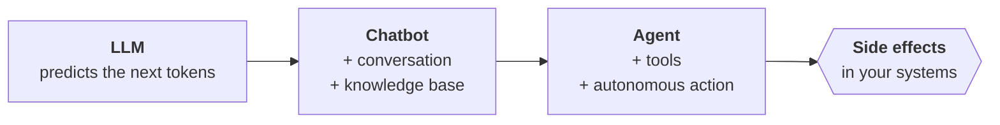
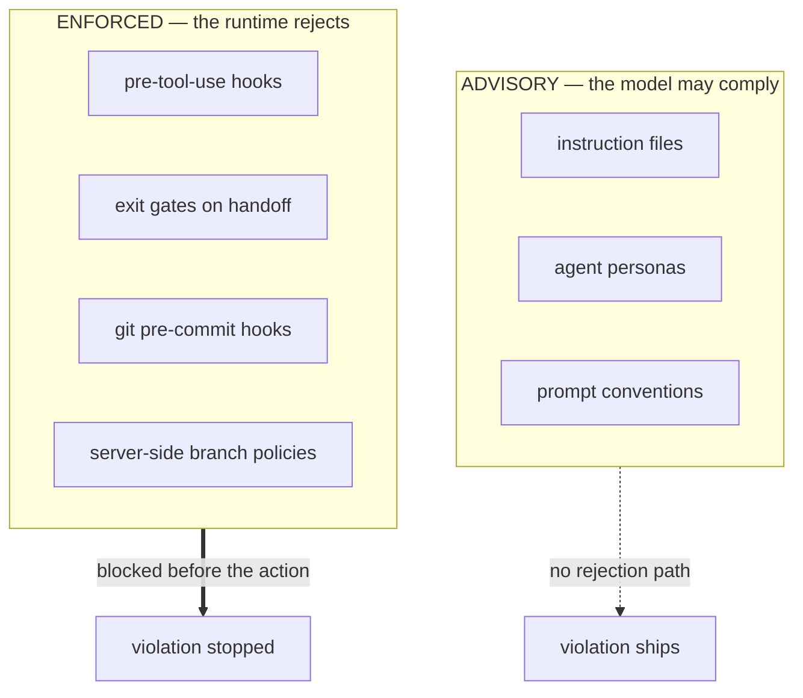
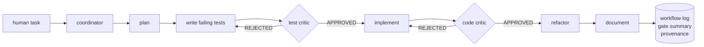
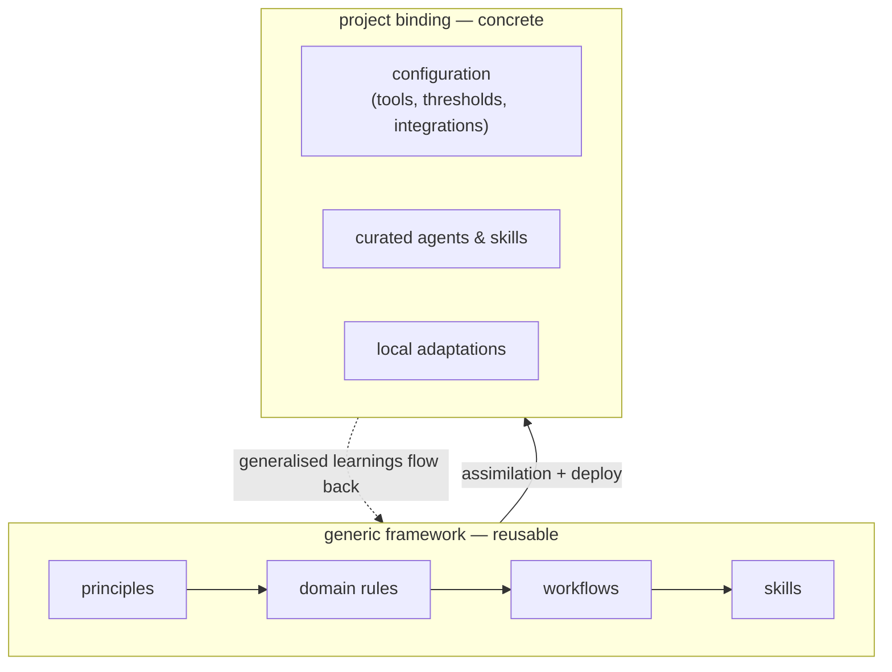
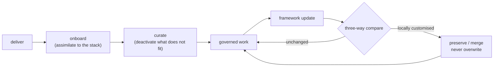

# Talk — Agentic AI Governance: Capability vs. Accountability

> **What this document is.** The content base, the narrative thread and the
> evidence inventory for the talk. It holds *what* is said, *why* it is
> defensible, and *which artefacts* back it up.
>
> **What this document is not.** It is not the slide deck. Building the deck is
> a separate, dedicated step. Nothing here prescribes layout, styling or slide
> counts beyond a rough budget.

---

## 1. Parameters

| Parameter | Decision |
|---|---|
| **Duration** | **25 minutes** talk + ~5 minutes Q&A (30 min slot). 20 min is not a hard floor; 25 is the working budget. |
| **Audience** | Mixed, cross-company, **heterogeneous prior knowledge**. Cannot assume familiarity with VS Code, Copilot, agent frameworks or the EU AI Act. |
| **Pacing** | Gentle on-ramp so nobody is lost, then a **steep climb** into the substance of AAIG. |
| **Language** | **English** (document and presentation). |
| **Format** | Slides + **prepared artefacts** (screenshots, code snippets, log excerpts). **No live demo** — too time-expensive and too fragile. One short **GIF or video snippet** to add motion is desirable. |
| **Project context** | **No concrete customer/project details.** It may be stated that the framework is *in productive use in real projects* — but no project names, no real data, no real repository content on screen. |
| **Positioning** | AAIG is **not a product**. It is a tool that emerged *alongside* real work to increase efficiency. The talk is not a sales pitch for the framework. |
| **Intent** | **Demonstrate competence.** The message is the advertisement: we have been working with generative AI since the LLM era, we understand agentic systems, and this is a current example of that. |

### Consequences of these parameters

- Artefacts must be **sanitised or synthetic** — realistic in shape, neutral in content.
- The tone is **experience report**, not vendor pitch. That permits — and requires —
  an honest limitations section, which is the single most credibility-building
  slide in a governance talk.
- "We have the competence" is *shown*, not *claimed*: through the precision of the
  distinctions drawn, through knowing exactly where enforcement ends and
  convention begins, and through naming the prior art fairly.

---

## 2. The core message

The talk has **one** thesis. Everything else serves it.

> **Orchestration for *capability* has become less necessary.
> Orchestration for *evidence* has not.**
>
> An agent with good instructions delivers a **result**.
> An agent inside a harness delivers the result **plus the proof of how it got there**.
> Where the process must be auditable, the proof *is* the deliverable.

### Why this framing and not the obvious one

The intuitive framing — *"models are black boxes, so we built our own agent
system to control them"* — is weaker than it looks, for three reasons:

1. **"Self-built" is not the load-bearing part.** Determinism and audit trails
   are also achievable with CI gates, branch policies, policy-as-code (OPA) or
   vendor hook systems. Claiming that only a bespoke framework can do this
   invites an easy takedown in Q&A.
2. **There is a fresh, prominent counter-position.** GitHub published *"The
   harness is all you need (mostly)"* on **2026-07-27**, in which Burke Holland
   argues you need neither multiple agents, nor custom agents, nor MCP servers,
   nor custom instructions to be highly successful with AI. Two days before this
   document was written. Someone in the room will have read it.
3. **Conceding "models are good enough now" and then fighting back is a losing
   sequence.** Better to *accept it up front* and pivot to the axis where it
   does not apply.

The chosen framing turns the counter-position into a **supporting witness**:
Burke Holland optimises for *individual developer productivity*. This talk
optimises for *organisational defensibility*. Different objective functions, no
contradiction. Saying that out loud is stronger than ignoring it.

### The honest historical arc (say this explicitly)

AAIG was started at a time when a dedicated harness was genuinely necessary
**for good results** — models needed the decomposition, the role separation and
the explicit process to produce usable output at all.

**That aspect has been overtaken by model capability.** Modern reasoning models
resolve broad instructions into concrete, competent work without bespoke agent
definitions.

**The other aspect has not been overtaken:** traceability and auditability of
the *process itself*. That is where the investment still pays, and that is what
the framework is now about. Admitting that half of the original motivation has
expired is exactly the kind of statement that makes the other half believable.

---

## 3. Narrative arc — the red thread

Five beats. Each one hands a question to the next.

| # | Beat | The question it leaves open |
|---|---|---|
| **A** | Tools mean side effects | *If it can act on my systems — how do I control it?* |
| **B** | We wrote it all down in Markdown | *…but what actually rejects a violation?* |
| **C** | Capability ≠ accountability | *So what does a harness that produces evidence look like?* |
| **D** | This is what it looks like | *Does that actually hold up?* |
| **E** | Here is what it cost and where it breaks | → Q&A |

The intro is not a history lesson — it already carries the punchline. The
limitations section is not an apology — it is the proof that the distinctions in
B and D were drawn honestly.

---

## 4. Section-by-section content

### Time budget

| Section | Minutes | Approx. slides |
|---|---|---|
| A · Entry: from LLM to side effects | 3 | 1–2 |
| B · Instruction ≠ Enforcement | 4 | 2 |
| C · The pivot: capability vs. accountability | 3 | 1 |
| D · What a governed run looks like | 10 | 5–6 |
| E · Limits, cost, close | 4 | 2 |
| Buffer | 1 | — |
| **Total** | **25** | **11–13** |

The hard rule: **D must not be a framework tour.** Two or three mechanisms shown
properly beat ten mechanisms listed.

---

### A · Entry — from LLM to side effects · 3 min

**Goal.** Bring everyone to a common baseline *without* spending the audience's
patience, and set up the thesis in the same breath.

**Do not** narrate the usual LLM → Chatbot → Agent history. Every audience has
heard it since 2024, and told neutrally it is three minutes of nothing.

**Instead: one single axis — *what is the system allowed to touch?***

| Stage | What it does | What it can touch |
|---|---|---|
| **LLM** | Predicts the most probable continuation of the input | Text in, text out. Nothing. |
| **Chatbot** | Turns that into a conversation; optionally grounded in a knowledge base | Its own context. Still nothing outside. |
| **Agent** | Has **tools** and decides autonomously when to use them | **Your files. Your repository. Your pipelines. Your systems.** |

**The line to land it:**

> The interesting step is not that it became smarter.
> The interesting step is that it acquired **side effects**.

That single sentence converts the on-ramp into the setup. From here the rest of
the talk is the answer to a question the audience is now already asking.

**Optional, if the room is very mixed:** one sentence on what "tool" means
concretely — read a file, run a test suite, create a commit, call an API. Keep
it to one sentence.

→ *Diagram 1.*

---

### B · Instruction ≠ Enforcement · 4 min

**Goal.** Establish the gap that the whole framework exists to close.

**B.1 — The obvious answer, and it is a real one.**

The simplest and most widely known means of steering an agent is the semantic
one: `copilot-instructions.md`, `AGENTS.md`, `CLAUDE.md` — a natural-language
definition of what to do and what not to do. Coding standards, architecture
rules, forbidden patterns.

This is, in essence, a **more civilised form of prompt engineering** — with the
important difference that today's reasoning models are genuinely good at
resolving general instructions into concrete, sensible decisions. It works. It
is not a strawman, and the talk must not treat it as one.

> **Precision note:** `AGENTS.md` is **emerging practice, not a ratified
> cross-vendor standard.** No formal specification was found. Say "convention",
> not "standard".

**B.2 — The turn.**

> So — we wrote everything down. Are we done?
>
> How would we actually *check*?

**B.3 — Name the problem precisely. "Black box" is the wrong word.**

The problem is not opacity. Traces and logs exist; you *can* look. The problem
is structural:

> **Nothing in the runtime rejects a violation.**
> Instruction files are **advisory**. There is no rejection path.

The headline for the slide:

> ### Instruction ≠ Enforcement

Corollaries worth one line each:

- The same task can be executed differently on every run — the model is not
  obliged to follow your process, and non-compliance is often **invisible in the
  result**. A correct-looking diff does not tell you whether the tests were
  written first.
- An agent asked to check its own work is not a control. It is the same
  judgement, applied twice.

**B.4 — The strongest evidence is our own framework's own wording.**

Two verbatim, quotable lines from the framework's own rule set — both are
statements *against interest*, which is exactly why they are persuasive:

> "An agent's self-check of its own structural output is always SOFT, not HARD.
> Only a *different* agent or an automated tool can enforce a HARD gate."
> — `quality-gates.instructions.md`

> "Agent prompts are conventions, **not the security boundary**."
> — `git-workflow.instructions.md`

The second line is the credibility anchor of the entire talk: we drew the border
between *suggestion* and *enforcement* ourselves, wrote it down, and did not
market across it.

**B.5 — External support.**

> "A change is not cheap just because the code was cheap to generate. It's cheap
> only if a human can confidently review and own the result."
> — Dalia Abuadas, GitHub, *"The cost of saying yes has changed"*, 2026-07-17

→ *Diagram 2.*

**Trap to avoid.** Do **not** quote any instruction-adherence failure rate.
No vendor publishes one. The argument is structural — *there is no rejection
path* — and it does not need a statistic. A made-up number would destroy the
credibility that B.4 just built.

---

### C · The pivot — capability vs. accountability · 3 min

**Goal.** Convert the gap from B into the thesis, and disarm the obvious
objection before it is raised.

**C.1 — Concede the part that is genuinely over.**

AAIG was started when a bespoke harness was necessary *for the result*. Today it
is not. Modern models handle broadly specified tasks competently on their own.
Say this plainly — it costs nothing and buys everything that follows.

**C.2 — Pre-empt the counter-position by name.**

Referencing GitHub's *"The harness is all you need (mostly)"* directly, and
agreeing with it, is far stronger than hoping nobody brings it up. The
resolution:

> He is right — **for productivity**.
> Productivity asks: *did I get a good result, faster?*
> Governance asks: *can I demonstrate how this result came about?*
> Those are different questions, and only one of them is answered by a better model.

**C.3 — The thesis slide.**

> **Capability ≠ Accountability.**
>
> A strong model can reach the goal.
> Without a harness you cannot **prove** how it got there,
> you cannot **block** the paths you forbade,
> and you have **no artefact** left to review.
>
> If only the result matters, the investment is not worth it.
> If the **process** must be demonstrable — *while it runs* — it is.

**C.4 — Sharpen the scope honestly.**

The claim is deliberately *not* "you must build your own framework". It is: **a
harness must exist, and it must enforce outside the model.** Whether it is
self-built, bought, or assembled from CI and branch policies is a second-order
question. Overreaching here is the single easiest way to lose a knowledgeable
room.

---

### D · What a governed run looks like · 10 min

**Goal.** Make it concrete and demonstrable rather than aspirational.

**Structural decision: concrete first, abstract second.**

The framework is *designed* top-down (principles → domain rules → workflows →
project binding). It is *understood* bottom-up. For 25 minutes and a mixed room,
presenting the L0–L4 abstraction hierarchy first is the wrong opening move.

Order:

1. **One real run through the pipeline** (~6 min) — with three artefacts shown.
2. **Then** the abstraction (~4 min) — as the answer to *"and why is this not
   hardcoded for one project?"*

#### D.1 — The run (~6 min)

Walk a single task through the pipeline and stop at exactly **three** places to
show an artefact. These three are the substance of the talk.

| Stop | Mechanism | What is shown | What it proves |
|---|---|---|---|
| **1** | **Hook denial** | The actual refusal message when an agent attempts a forbidden action (e.g. a force push or a push to a protected branch) | Enforcement happens **outside the model**, deterministically, **before** the action — not as a suggestion, not as a post-hoc finding |
| **2** | **Maker-Checker verdict** | A critic agent's parseable `REJECTED` verdict with the concrete gate that failed, and the resulting retry | Handoffs between agents are **gated and auditable**; the reviewer is a *different* actor than the maker |
| **3** | **Evidence artefacts** | Workflow log, gate summary, provenance marker in the produced file | The run leaves a **record**, not just a diff |

Supporting points, one line each — resist elaborating:

- **Gate taxonomy: HARD / SOFT / ADVISORY.** HARD is automated and binary and
  blocks the handoff. SOFT is a judgement call and goes to a reviewer. ADVISORY
  is measured and never blocks. Deciding *which* is which is the actual
  engineering work.
- **BLOCKED is a third outcome.** If the tool needed to verify a HARD gate is
  unavailable, the gate is reported BLOCKED — never silently passed. Escalation,
  not assumption.
- **Complexity tiers.** Gates scale with the size and risk of the change.
  Governance that costs the same for a typo as for a new module gets switched
  off. This is not a footnote — it is the reason the framework survives contact
  with daily work.
- **Escalation is a designed exit.** Agents halt and hand back to a human on
  ambiguity or repeated failure, rather than improvising.

→ *Diagram 3.*

#### D.2 — Then the abstraction (~4 min)

Now, and only now, the layer model — framed as the answer to *"is this one
project's bespoke setup, or is it reusable?"*

- **Top-down derivation.** A small set of guiding principles — separation of
  concerns, least privilege, security, traceability, maker-checker — from which
  domain rule sets and workflows are *derived*. Everything at this level is
  generic and free of any project specifics.
- **Assimilation instead of configuration.** Rolling the framework into a
  project is not a copy job. The framework is *adapted* to the identified tech
  stack — inferred from the existing codebase, requirements and planning
  documents where they exist, and elicited through targeted questions where they
  do not.
- **Curation as context hygiene.** Only the agents and skills that actually
  match the project stay active; the rest are deactivated and physically moved
  aside. The purpose is to keep the context free of irrelevant definitions —
  which is both a quality and a cost argument.
- **Configuration as the seam.** Project-specific tool integration and settings
  live in a configuration layer, not in the generic definitions. That separation
  between *generic framework* and *concrete project knowledge* is what makes the
  thing reusable at all.
- **Backflow.** Improvements discovered in a project can be generalised and
  flow **back** into the framework. This is the part that makes it compound
  rather than fork.
- **Non-destructive updates.** A re-deploy updates the framework inside a
  running project **while preserving local adaptations** — through three-way
  comparison, explicit conflict classification, and managed regions that let
  generic and local content coexist inside one file.

**One sentence to close D:**

> None of this is about making the agent smarter.
> All of it is about making the run **reviewable**.

→ *Diagrams 4 and 5.*

**Explicitly out of scope for the talk** (available for Q&A, not for slides):
benchmark and rubric machinery, the full domain rule catalogue, deploy tooling
internals, MCP transport details, worktree mechanics.

---

### E · Limits, cost, and close · 4 min

**Goal.** Convert the talk from a presentation into a credible experience report.
This section is not optional — without it, a governance talk reads as marketing.

**E.1 — Where the boundary genuinely is.**

- Agent prompts are conventions. The **real** boundary is server-side: branch
  policies, permission scoping, and hooks that execute regardless of what the
  agent intended. Repeating the B.4 quote here closes the loop.
- Some intended controls are **aspirational, not implemented** — and are
  documented as such inside the framework rather than quietly listed as
  features.
- There are real operational limitations (for example, constraints on running
  multiple governed workstreams in parallel). Naming one concrete limitation is
  worth more than a generic "of course nothing is perfect".

**E.2 — Own the cost.**

Maker-checker deliberately **adds** refinement loops. That is not a side effect,
it is the mechanism. Pretending it is free would be the one dishonest moment in
the talk.

The defensible framing, using published figures:

- ~**60 %** of an agentic task's cost is tied to *refining* answers, not to the
  first pass. (McKinsey, 2026-07-13)
- The same task can vary by a **factor of 30** between completions.
  (McKinsey, 2026-07-13)
- **93 %** of surveyed organisations exceed their AI budgets; about **one fifth**
  have constrained AI use because of operating cost. (McKinsey, 2026-07-13)

> Governance does not create the refinement cost — it makes it **predictable**.
> A factor-of-30 spread is not a quality problem, it is a **planning** problem.
> Bounded autonomy is what turns it into a number you can budget.

And the counter-example that shows scaffolding is a real lever rather than
overhead: GitHub replaced its code-review agent's tools with "better" generic
ones and the output got **worse**; rewriting the tool instructions to match the
actual reviewer workflow then cut average review cost by roughly **20 %** at
equal quality. (GitHub, 2026-07-10)

**E.3 — Fair positioning against prior art.**

One slide. Naming the neighbours accurately is a competence signal in itself.

| | What it covers | Relation |
|---|---|---|
| **GitHub Spec Kit** | Spec-driven development: constitution → specify → plan → tasks → implement. Large community, many agent integrations. | **Complementary.** Spec Kit is the *workflow*; this is the *harness*. Say so plainly. |
| **Claude Code** | Tool restrictions, human confirmation for irreversible actions | Overlapping enforcement primitives; no published audit-trail framework |
| **GitHub Copilot** | Subagent routing, internal benchmarks and traces | Observability without a public hook system; CI + branch protection carry the gating |
| **Cursor Rules** | Editor-level behavioural constraints | Semantic layer only |
| **Policy-as-code (e.g. OPA)** | Deterministic policy enforcement | The right idea, but not wired into the agent coordination loop |

**What is table stakes in 2026:** instruction files, tool restrictions,
subagent routing, spec-first workflows.
**What is still uncommon:** deterministic hooks, provenance marking, and an
explicit gate taxonomy **integrated into the agent coordination loop itself**
rather than bolted on around it.

**E.4 — Regulation, handled carefully.**

Tempting and easy to overclaim. What is actually defensible:

- **ISO/IEC 42001** (AI management systems) and the **NIST AI RMF Generative AI
  Profile** expect traceability and documentation as management controls. Both
  are **voluntary**.
- The **EU AI Act, Article 50** (transparency / marking of AI-generated content)
  becomes enforceable on **2026-08-02**. Whether an *internal* coding agent falls
  under it is genuinely contestable — present it as a direction of travel, not
  as an obligation you are already under.
- **IEC 62304 does not require AI provenance.** Do not say it does.

The safe and still-strong formulation:

> Provenance is the process argument you will be asked for —
> before there is an explicit clause requiring it.

**E.5 — Close (1 min).**

Three sentences, then the Q&A slide:

- **What it bought us:** a run that can be reviewed, and a process that survives
  the person who designed it.
- **What it cost us:** more loops, more artefacts, and the discipline to keep the
  gates cheap enough that nobody disables them.
- **What we would do differently:** start from enforcement and add semantics —
  not the other way around.

Closing line, tying back to A:

> Better models removed the need to orchestrate for **capability**.
> They did not remove the need to orchestrate for **evidence**.

---

## 5. Diagram proposals

Draft form only. Final visual treatment belongs to the deck-building step.

### Diagram 1 — The side-effect axis (Section A)

*Intent:* one axis, one punchline. The arrow into "side effects" is the whole
message of section A.

### Diagram 2 — Instruction vs. Enforcement (Section B)

*Intent:* the visual argument of the talk. Dotted line = hope; solid line =
mechanism. If the audience remembers one image, this should be it.

### Diagram 3 — A governed run (Section D.1)

*Intent:* show that the loop-backs are the point. Overlay the three artefact
stops (hook denial, verdict, evidence) as callouts on this diagram rather than
as separate slides.

### Diagram 4 — Generic vs. project-specific (Section D.2)

*Intent:* the reusability argument in one picture. The dotted backflow arrow is
what separates a framework from a template.

### Diagram 5 — Lifecycle and non-destructive update (Section D.2)

*Intent:* answers *"what happens to my customisations when you ship v2?"* —
the first question any practitioner in the room will have.

---

## 6. Artefact inventory

All artefacts must be **sanitised or synthetic**: realistic in structure,
neutral in content. No project names, no customer data, no real repository paths.

| # | Artefact | Section | Form | Status |
|---|---|---|---|---|
| 1 | Hook denial message for a forbidden git operation | D.1 | Terminal screenshot | to produce |
| 2 | Critic `REJECTED` verdict incl. the failed gate | D.1 | Code/text block | to produce |
| 3 | Gate summary block (HARD/SOFT/ADVISORY counts) | D.1 | Text block | to produce |
| 4 | Workflow log excerpt (YAML) | D.1 | Code block | to produce |
| 5 | Provenance marker in a generated file | D.1 | 2-line code snippet | to produce |
| 6 | Conflict classification output of a re-deploy | D.2 | Text block | to produce |
| 7 | **GIF / short video: one gated handoff running** | D.1 | 10–20 s loop, no audio | to produce |
| 8 | The two self-quotes (self-check is SOFT; prompts are not the security boundary) | B.4 / E.1 | Pull quote | ready — verbatim in the repo |

> **On the GIF (item 7).** It is the only motion in the talk, so it should show
> the single most convincing moment: an agent attempting something forbidden and
> being stopped — or a critic rejecting and forcing a retry. Keep it under 20
> seconds, no narration, and loop it while speaking.

---

## 7. Defensible facts and sources

Everything cited on a slide must appear in this table. Nothing else gets cited.

| Claim | Figure | Source | Date |
|---|---|---|---|
| Better generic tools made an agent *worse*; re-tuning instructions cut review cost | **~20 %** lower cost at equal quality | GitHub Engineering — *"Better tools made Copilot code review worse — here's how we actually improved it"* | 2026-07-10 |
| Multi-agent complexity is optional; the harness is the lever | qualitative | GitHub — *"The harness is all you need (mostly)"* (Burke Holland) | 2026-07-27 |
| Cheap generation ≠ cheap change; reviewability is the real cost | qualitative | GitHub — *"The cost of saying yes has changed"* (Dalia Abuadas) | 2026-07-17 |
| Organisations exceeding AI budgets | **93 %** | McKinsey — *"Is that AI agent worth it?"* | 2026-07-13 |
| Organisations constraining AI use due to operating cost | **~1 in 5** | McKinsey, ibid. | 2026-07-13 |
| Share of agentic task cost tied to refining answers | **~60 %** | McKinsey, ibid. | 2026-07-13 |
| Variation between completions of the same task | **factor 30** | McKinsey, ibid. | 2026-07-13 |
| EU AI Act Article 50 transparency obligations enforceable | date | EU AI Act, Art. 50 | from **2026-08-02** |
| AI management system standard (voluntary) | — | ISO/IEC 42001:2023 | 2023-12 |
| Generative AI risk profile (voluntary) | — | NIST AI RMF, NIST.AI.600-1 | 2024-07-26 |
| Spec-driven development, large ecosystem | 240+ contributors, 35+ agent integrations | GitHub Spec Kit | 2026-07 |

### Claims that must NOT be made

| ✗ Do not say | Why |
|---|---|
| "Scaffolding is obsolete now that models are strong." | The opposite is evidenced — GitHub's win came *from improving* scaffolding. |
| "X % of agent runs violate their instructions." | No vendor publishes adherence rates. Any number here is invented. |
| "Y % of AI-generated code contains defects." | No credible published statistic was found. |
| "IEC 62304 requires AI provenance marking." | False. It does not address AI-generated code at all. |
| "`AGENTS.md` is a cross-vendor standard." | It is emerging *practice*. No published specification found. |
| "We solved multi-agent orchestration." | Overclaim; the field is still learning. Frame as deterministic harness + human review. |
| "The EU AI Act obliges us to mark AI-generated code." | Contestable for internal tooling. Present as direction of travel. |
| Anything naming a real project, customer or dataset. | Explicitly out of scope per §1. |

---

## 8. Anticipated Q&A

Five minutes, so three or four questions at most. These are the likely ones.

| Question | Answer in one breath |
|---|---|
| **"Why not just do this in CI?"** | CI gates the **result**; hooks gate the **process**, in flight, at the handoff points *between* agents — which CI cannot see, because no artefact exists yet. And a pre-action hook prevents what CI could only detect afterwards. Use both: CI is the outer ring, hooks are the inner one. |
| **"GitHub says the harness is all you need — isn't this over-engineering?"** | Agreed, for productivity. The disagreement is about the question being asked: *good result faster* vs. *demonstrable process*. Only the first is solved by a better model. |
| **"What does this cost in tokens and time?"** | It adds refinement loops on purpose. Published figures put ~60 % of agentic task cost in refinement anyway, with a factor-30 spread between runs. The gain is predictability, and the tiering keeps small changes cheap. |
| **"Do the agents actually follow this?"** | The semantic layer — sometimes. That is precisely why the enforcement layer exists outside the model, and why self-checks are classified as non-binding by design. |
| **"Isn't this locked to one vendor?"** | The generic layer is vendor-neutral; the vendor-specific part is an exchangeable adapter. That separation is the reason for the layered structure. |
| **"Can we get it?"** | It is not a product — it grew out of real project work. Happy to talk about the principles and what transfers. |

---

## 9. Open items before the deck is built

- [ ] Produce artefacts 1–7 (sanitised / synthetic).
- [ ] Decide which single limitation from E.1 is named concretely.
- [ ] Confirm the talk date against the **2026-08-02** EU AI Act milestone —
      before vs. after changes the tense of that statement.
- [ ] Verify each figure in §7 against its source once more immediately before
      the talk (all are from July 2026 and none are load-bearing if dropped).
- [ ] Rehearse for time. Section D is the one that will overrun; section A is the
      one that must not.
- [ ] Decide whether the closing slide shows contact/discussion pointers.

---

## 10. Rejected alternatives (for the record)

| Considered | Rejected because |
|---|---|
| Opening with the L0–L4 layer model | Correct as design, wrong as pedagogy. Abstract-first loses a mixed room in 25 minutes. |
| Full framework tour in section D | Ten mechanisms listed convince nobody; three shown properly do. |
| Thesis "only self-built agent systems can guarantee this" | Easy to refute — CI, OPA and vendor hooks also enforce. Narrowed to "a harness must exist and must enforce outside the model". |
| Live demo | Too expensive in a 25-minute slot and too fragile. Replaced by artefacts + one GIF. |
| Leading with regulation | Overclaims quickly, and the audience is mixed-industry. Regulation supports the argument; it does not carry it. |
| Quoting instruction-adherence failure rates | No such published figures exist. The structural argument is stronger anyway. |
