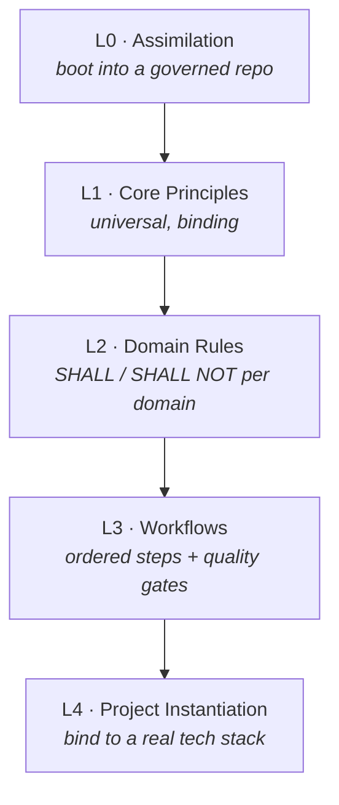

# Overview

**Agentic AI Governance (AAIG)** is a framework that lets autonomous AI agents
do real engineering work — writing code, tests, infrastructure, and docs —
*without* sacrificing safety, traceability, or quality. It replaces "trust the
model" with **explicit rules, independent review, and programmatic quality
gates**.

## The problem it solves

Autonomous agents are capable but unaccountable by default: they can guess when
uncertain, act outside their remit, skip verification, and leave no audit
trail. AAIG constrains that behavior with six ideas that run through every
layer:

1. **Fail-safe & ask first** — never guess; halt and escalate on uncertainty.
2. **Independent review** — no output is final until a *different* reviewer signs off (maker-checker).
3. **Metrics as proof** — quality gates are computed by tools, not asserted in prose.
4. **Traceability** — every phase produces a reviewable artifact; every agent action is attributable.
5. **Separation of concern** — each agent/role has one clear responsibility.
6. **Human-in-the-loop** — humans retain full authority to override at any time.

These are formalized in the [Core Principles (L1)](03-core-principles.md).

## The shape of the framework

AAIG is organized as a **monorepo** with two halves (see [Architecture](02-architecture.md)):

- **`core/` — the generic framework.** Platform-agnostic governance: the
  universal principles, per-domain rules, reusable workflows, a skills library,
  and a compliance benchmark. This is the source of truth.
- **`flavors/` — concrete implementations.** Adaptations wired into a specific
  agent engine. The reference flavor is
  [`github-copilot/`](09-flavor-github-copilot.md): a drop-in `.github/`
  package that turns VS Code + GitHub Copilot into an autonomous, gated,
  multi-agent TDD team.

## Five levels, from universal to project-specific

Governance is layered L0→L4, each level derived from the one above:

- **[L0 Assimilation](04-assimilation.md)** — the boot sequence: an agent discovers its host, maps capabilities, and compiles AAIG into the host's native format.
- **[L1 Principles](03-core-principles.md)** — the universal behavioral contract.
- **[L2 Domains](05-domains.md)** — concrete rules for Software Dev, Data Engineering, ML Ops, Infrastructure, Security, Technical Writing, Embedded.
- **[L3 Workflows](06-workflows.md)** — procedures like Feature Development and Bug Fix, with explicit entry/exit gates.
- **L4 Project Instantiation** — binds a workflow to *your* stack, tools, and thresholds (see [Architecture](02-architecture.md)).

Supporting all levels: a [Skills Toolbox](07-skills-toolbox.md) of expert
templates and a [Benchmark](08-benchmark.md) that grades compliance.

## What "running" AAIG looks like

In the [GitHub Copilot flavor](09-flavor-github-copilot.md), you describe a
task and a [coordinator](10-agents.md) drives a full pipeline — plan → failing
tests → implementation → refactor → review → docs — across specialized agents.
[Critics review every output](10-agents.md); [deterministic hooks](11-hooks-and-autonomy.md)
run the tests, scan for secrets, and block destructive commands. You stay in
control through mandatory escalation points.

## Where to go next

- Understand the structure → [Architecture](02-architecture.md)
- Understand the rules → [Core Principles](03-core-principles.md)
- See the concrete tool → [Flavor: GitHub Copilot](09-flavor-github-copilot.md)
- Deploy or update it → [Deployment](12-deployment.md)
