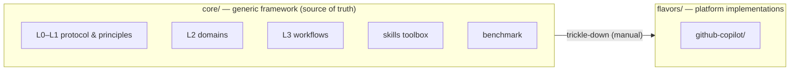

# Architecture

This page answers **how AAIG is organized**. It has two structural axes: the
**monorepo split** (generic vs platform-specific) and the **five governance
levels** (universal vs project-specific).

## Monorepo split

- **`core/`** holds the abstract, platform-agnostic governance: the assimilation
  protocol, the core principles, domain rule sets, workflow templates, the
  skills library, and the compliance benchmark. *Change governance behavior
  here first.*
- **`flavors/`** holds concrete adaptations coupled to a specific IDE / LLM
  engine. The reference is [`github-copilot/`](09-flavor-github-copilot.md).
  Core changes are **manually trickled down** into each flavor's native syntax
  (see [Governance Change](14-governance-change.md)).

## The five levels (L0–L4)

Each level is structurally distinct and **derived from the level above**. An
artifact is *properly derived* when it references its parent artifact, has
passed review, carries a version identifier, and does not contradict any
ancestor.

| Level | Name | Nature | Example |
|---|---|---|---|
| **L0** | [Assimilation](04-assimilation.md) | Boot sequence | Discover host, compile AAIG into native config |
| **L1** | [Core Principles](03-core-principles.md) | Universal, binding | Fail-Safe, Traceability, Separation of Concern |
| **L2** | [Domain Rules](05-domains.md) | `SHALL / SHALL NOT` per domain | `R-SD-04`: tests must pass before merge |
| **L3** | [Workflows](06-workflows.md) | Ordered steps + gates | Test-Driven Development cycle |
| **L4** | Project Instantiation | Bind to a real project | Coverage ≥ 85%, `pytest`, `ruff` |

> **L3/L4 pragmatism.** Though conceptually distinct, L3 workflows and L4
> bindings may be physically combined into one execution file (e.g. an agent
> prompt or `copilot-instructions.md`) for token efficiency.

**L4 project instantiation** takes a generic workflow and binds its
`[L4-DEFINED]` placeholders to project specifics: tech stack, tools, quality-
gate thresholds, and which external capabilities are `required` vs `optional`.
The template lives at `core/L4_Project_Template.md`; in a governed repo it is
deployed to `.aaig/L4_Config.md`. In the Copilot flavor, these bindings live in
[`af-env.conf`](13-configuration.md) and `copilot-instructions.md`.

## Roles

| Role | Responsibility |
|---|---|
| **Primary Agent** | Produces the deliverable; proposes quality gates |
| **Reviewer** | Evaluates the Primary's output; in multi-agent setups must **not** be the same agent |
| **Quality-Owner** | Approves quality-gate definitions; defaults to the human User |
| **Capability Worker** (optional) | Integrates one external platform capability through a narrow interface |

When fewer agents exist than roles require, roles may combine — but a Maker must
never approve its own work for non-trivial tasks. As the team grows, roles
separate per [Separation of Concern](03-core-principles.md).

### Capability workers & cells

External integrations (issue trackers, wikis, CI/CD, registries) are modeled as
**capability cells**: a provider-scoped worker + a reusable skill package +
explicit quality gates for availability, fallback, and traceability. Workers
follow the naming pattern `{provider}-{capability}-{role}` (e.g.
`ado-wiki-manager`). Cells are optional unless the [L4 contract](13-configuration.md)
marks them required — see [Platform Optionality](03-core-principles.md).

## Governance change protocol

Changes to **L0/L1** documents are high-risk (they propagate to all downstream
levels) and require mandatory human review, a cross-level impact assessment, a
version bump, and a changelog entry. Full detail on
[Governance Change](14-governance-change.md).

## See also

- [Overview](01-overview.md) — the same picture at high altitude
- [Flavor: GitHub Copilot](09-flavor-github-copilot.md) — how this architecture becomes a running tool
