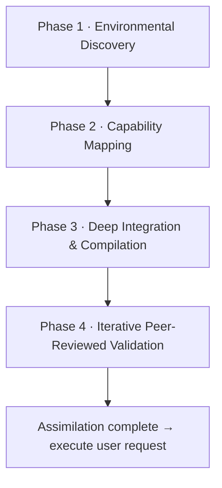

# Assimilation (L0)

Level 0 is the **chronological entry point**: the sequence an agent must
complete *before* executing the user's primary request when it enters a
repository governed by AAIG. The goal is to compile the framework into the
host's **native** configuration format rather than merely copying markdown.

## The four phases

### Phase 1 — Autonomous Environmental Discovery

Determine the host without hard-coded assumptions: identify the **host engine /
IDE** and versions, probe **terminal capabilities** (persistent shell, network,
runtimes), research the **highest-fidelity syntactic schema** the host supports
for agent instruction (YAML frontmatter? strict JSON tool arrays? macro
triggers?), and classify the project as **Empty**, **Evolving**, or **Legacy**.

### Phase 2 — Capability Mapping

Map discovered capabilities against AAIG's requirements:

- **Restricted** environments defer quality gates to humans or external CI.
- **Unrestricted** environments own running tests, static analysis, and builds
  before concluding a task.
- **Offline / air-gapped** environments declare Offline Mode and list
  network-dependent gates as `deferred_gates` for human review.
- If the host natively logs conversation/actions, reuse that as the action log
  instead of duplicating it.

### Phase 3 — Deep Integration & Compilation

Deploy the **full** framework (all L2 domains, all L3 workflows, all skills)
into the `.aaig/` source-of-truth directory, then **compile the active set into
native configs** targeting the exact schema found in Phase 1:

- **Empty projects:** HALT and request a tech-stack + goal definition first.
- **Specialization Prompt:** present the User a menu of domains/skills; the User
  activates a subset (or "all"). Selected → **Active**; the rest → **Deployed
  (Dormant)**, available on demand without re-assimilation.
- **Native compilation:** maximize the host's capability boundaries (native
  permissions, automation hooks, sandboxed scopes) so AAIG rules cannot be
  trivially bypassed.
- **Legacy grandfathering:** do not force mass refactors; enforce AAIG on the
  *diff*.
- **Multi-agent orchestration:** if the host supports personas/subagents,
  decompose the active set into scoped native agents — including at least one
  distinct **Reviewer** subagent to satisfy independent review.
- Declare a **Contract** summarizing host identity, scoped permissions, active
  specializations, and the workflow contract.

### Phase 4 — Iterative Peer-Reviewed Validation

Before doing the user's work, an independent **Reviewer** agent audits the
generated integration for **syntactic validity**, **structurally enforced
separation of concern** (makers technically blocked from approving), and
**natively wired quality gates**. The loop repeats until zero major findings.

## In the Copilot flavor

The abstract `.aaig/` compilation is realized as the deployable
[`.github/` package](09-flavor-github-copilot.md): native `.agent.md` personas,
`.instructions.md` rule files, deterministic [hooks](11-hooks-and-autonomy.md),
and [`af-env.conf`](13-configuration.md) as the L4 binding. Deploying it is the
practical equivalent of Phase 3 — see [Deployment](12-deployment.md).

## See also

- [Architecture](02-architecture.md) · [Core Principles (L1)](03-core-principles.md) · [Agent Team](10-agents.md)
