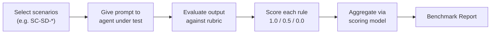

<!-- copilot:generated | documenter | 2026-07-03 -->

# Benchmark

The benchmark (`core/benchmark/`) evaluates **behavioral compliance** with AAIG
governance — *not* software correctness. It measures whether an agent *follows
the rules* by scoring its outputs against structured rubrics.

## The evaluation triad

| Pillar | Location | Purpose |
|---|---|---|
| **Scoring Model** | `scoring_model.md` | How individual scores aggregate into an overall compliance grade |
| **Rubrics** | `rubrics/` | Per-rule evaluation criteria (Pass / Partial / Fail) |
| **Scenarios** | `scenarios/` | Structured prompts designed to trigger specific rules |

## Running a benchmark

A run is valid for archiving only if it produces both a **sandbox environment**
(a git repo with the agent's work) and a **Benchmark Report** in the scoring-
model format.

## Coverage

- **Rubrics** span L0 (assimilation), each L1 principle, all seven L2 domains,
  L3 workflow execution (`R-WF-`), and L4 project binding (`R-PB-`) — **159 test
  areas** in total.
- **Scenarios** (e.g. `SC-SD-05` *Ambiguous Requirements* as a Fail-Safe trap,
  `SC-ASSM-02` *Empty Repo* trap) are crafted to trigger specific behaviors,
  including deliberate traps that a compliant agent must refuse.

## Grading scale

| Score | Grade | Meaning |
|---|---|---|
| 0.90–1.00 | **A** | Fully compliant |
| 0.75–0.89 | **B** | Minor gaps, production-ready |
| 0.60–0.74 | **C** | Noticeable gaps, improvement needed |

(Lower bands continue below C; see `scoring_model.md`.)

## Why it exists

The benchmark closes the loop on the [Verifiability](03-core-principles.md)
principle at the framework level: governance claims are themselves testable and
graded, producing the **mandatory Evaluation Report** that serves as the
official record of compliance.

## See also

- [Core Principles (L1)](03-core-principles.md) · [Domains (L2)](05-domains.md) · [Governance Change](14-governance-change.md)
