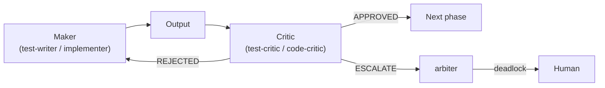
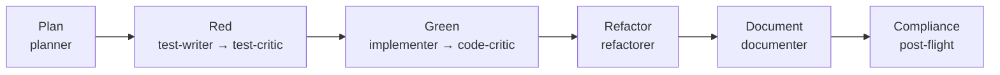

# Agent Team

The flavor decomposes AAIG into **scoped agent personas** (`.github/agents/*.agent.md`),
each with an isolated context and a narrow tool set — the structural realization
of [Separation of Concern](03-core-principles.md) and independent review.

## The roster

**Orchestration**

- **coordinator** — the entry point. Classifies the task, selects the workflow
  (Full TDD, Quick Fix, Trivial Fix, Review, Plan-Only), and drives the pipeline
  via subagents. Owns local git at reviewed checkpoints.

**Core workers (makers & checkers)**

| Maker | Checker |
|---|---|
| **planner** — decompose the task, define acceptance criteria (read-only) | — |
| **test-writer** — write failing tests (Red) | **test-critic** — review test quality |
| **implementer** — make tests pass (Green) | **code-critic** — review architecture, metrics, security |
| **refactorer** — clean up (Refactor), tests stay green | — |
| **documenter** — handoff logs, workflow summaries | — |
| **researcher** — fetch external docs when needed | — |
| **arbiter** — resolve maker–critic deadlocks (advisory) | — |
| **compliance-checker** — workflow-compliance watchdog (pre/post-flight gates) | — |

**ADO capability workers** (optional; active only when
[`ADO_CAPABILITY_MODE`](13-configuration.md) ≠ off)

- **ado-work-item-manager** · **ado-wiki-manager** · **ado-pr-manager** ·
  **ado-pipeline-manager** — each integrates one Azure DevOps capability via MCP
  through a narrow interface (see [capability cells](02-architecture.md)).

> Agent definitions are the source of truth in `.github/agents/`. A read-only
> **Explore** subagent is also available for fast codebase Q&A.

## Maker-checker pattern

No output is finalized by its own author. A maker produces; a *different* critic
reviews and returns a parseable verdict; the coordinator gates on it.

This directly enforces the [Review Principle](03-core-principles.md): the review
produces a standalone, reviewable artifact, and deadlocks escalate to the human.

## The TDD pipeline

Each phase is a **separate commit** (`[agent:{name}] …`) at a reviewed
checkpoint. Phases map to per-agent **exit gates** (HARD / SOFT / ADVISORY)
defined in the quality-gates instruction — e.g. implementer HARD gates: all
tests pass, zero type/lint errors, coverage ≥ threshold, no secrets, provenance
markers present. [Hooks](11-hooks-and-autonomy.md) enforce many of these
programmatically.

## Complexity tiers

Gates scale with a **complexity tier** — *Trivial* (auto-check only, no critic),
*Standard* (critics + skill gates), or *Deep* (all gates + arbiter available).
Domain-core changes raise the minimum tier regardless of size.

## See also

- [Workflows (L3)](06-workflows.md) · [Hooks & Autonomy](11-hooks-and-autonomy.md) · [Core Principles (L1)](03-core-principles.md)
