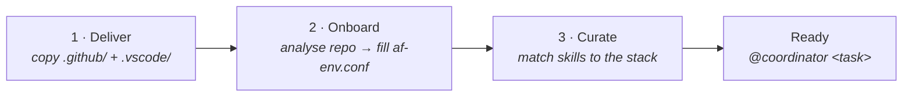
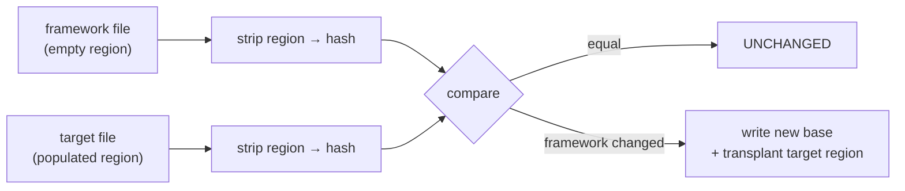

# Deployment & Versioning

Deployment is the practical realization of [L0 assimilation](04-assimilation.md):
the generic framework is **delivered** into a target repository and then
**adapted** to that repository's tech stack. A raw file copy is not an
assimilation — the adaptation steps are what make the framework reusable.

## The three-step lifecycle



| Step | Command | What it does |
|---|---|---|
| **1 · Deliver** | `deploy.ps1` / `deploy.sh`, or the [MCP path](#two-delivery-paths) | Writes the AF-owned files listed in `.af-manifest` into the target's `.github/` and `.vscode/` |
| **2 · Onboard** | `/af-onboard-project` | Analyses the existing codebase (or interviews the user for an empty repo) and fills the [L4 binding](13-configuration.md): `SRC_DIR`, dependency files, linting strictness, notebook usage, provider mode |
| **3 · Curate** | `/af-curate-skills` | Matches the [skills toolbox](07-skills-toolbox.md) against the detected stack; activates the relevant subset and **deactivates** the rest |

`/af-setup-project` runs all three in one pass with a single human confirmation.

> **Why curation matters.** Every active skill and instruction occupies context
> on nearly every request. Curation is the [Efficiency
> principle](03-core-principles.md) made operational: deploy everything, keep
> only what this project needs *active*.

## Two delivery paths

Both paths implement the **same** classification and byte-canonicalization
logic, so switching between them produces no spurious diffs.

| Path | Invocation | Notes |
|---|---|---|
| **Scripts** | `deploy.ps1` (Windows) / `deploy.sh` (macOS/Linux) | The supported, CI-integrated default. Needs the AF repo next to the target. |
| **MCP server** | `af-deploy-mcp` (stdio); prompts `/mcp.af.deploy`, `/mcp.af.resolve_conflicts` | **Experimental, runs in parallel.** Ships the payload *inside the installed wheel*, so no AF clone next to the target is needed. |

### Script usage

```powershell
# Preview first (no changes), then apply
.\deploy.ps1 -TargetDir "<path-to-project>" -DryRun
.\deploy.ps1 -TargetDir "<path-to-project>"
```

### MCP tools

The MCP server exposes deployment as agent-callable tools. Write tools are inert
unless `confirm=true`:

| Tool | Kind | Purpose |
|---|---|---|
| `status` | read | Bundled framework version vs. version deployed in the target |
| `dry_run` | read | Classify every deployable file (three-way), no writes |
| `conflict_diff` | read | Unified diff between the deployed file and the resolved source |
| `apply` | write | Write CREATE/UPDATE files, back up first, skip conflicts & customizable; also stamps `.af-version` |
| `write_resolved` | write | Write an agent-merged file during conflict resolution |
| `update_hashes` | write | Re-baseline `.af-hashes` after conflicts are resolved |
| `list_orphans` / `prune_orphans` | read / write | Find and remove baselined framework files left behind by a rename or manifest change |
| `prune_backups` | write | Remove stale `.af-backup-*` directories |

The payload is resolved in a fixed order: `AF_SOURCE_ROOT` → hash-pinned
**remote payload** (`AF_PAYLOAD_URL` + mandatory `AF_PAYLOAD_SHA256`, verified
before extraction) → payload bundled in the wheel → in-repo flavor directory
(dev mode). Remote-payload mode lets an operator pin every install to one
centrally published, integrity-verified framework version.

> **Not MCP-native.** VS Code still consumes agents, instructions, prompts and
> skills as **files on disk**. MCP *delivers* those files; it does not turn them
> into MCP primitives.

## Classification & three-way merge

Deploy tracks a baseline in `.github/.af-hashes` and a version marker in
`.github/.af-version`. Comparing *baseline vs. framework source vs. deployed
file* yields one classification per file:

| Class | Meaning |
|---|---|
| **UNCHANGED** | All three sides agree — nothing to do |
| **CREATE** | The framework ships a file the target does not have |
| **UPDATE** | Framework changed, target untouched — safe to overwrite |
| **PRESERVE** | Target modified a `[customizable]` file — never overwritten |
| **CONFLICT** | Both sides changed — skipped, backed up, flagged for a human/agent merge |
| **DEACTIVATED** | The framework ships `skills/{name}/` but the target moved it to `skills/_available/{name}/` — deliberately off; never re-created |

`.af-manifest` annotates each entry: `[customizable]` (project may modify;
protected on update — e.g. `af-env.conf`, `copilot-instructions.md`,
`architecture.instructions.md`, `tasks.json`), `[optional]` (may be absent
without warning), and `[vscode]` (deployed to `.vscode/` instead of `.github/`).

### Canonical bytes

All deploy paths write **one canonical byte representation** — UTF-8 without
BOM, LF line endings, agent model-tier tokens resolved — and hash exactly those
bytes. A repo `.gitattributes` (`* text=auto eol=lf`) keeps the source blobs
deterministic. Without this, switching between `deploy.ps1` and the MCP path
produced whole-file diffs from CRLF/BOM drift.

### Managed regions

A framework file may carry an `AF:MANAGED:{name}:START/END` marker pair whose
body is **project territory**. Deploy hashes the region-*stripped* file for
classification and transplants the target's region body onto the incoming
framework base on write.



So a project can populate the region locally (e.g. curated skill assignments
inside an agent file) without ever tripping a CONFLICT, while framework changes
*outside* the region still UPDATE normally. Byte-identical strip/merge is
implemented in all three deploy paths (`deploy_core.py`, `deploy.ps1`,
`deploy.sh`) and guarded by cross-tool parity tests.

> **Use sparingly.** Prefer [`af-env.conf`](13-configuration.md) for project
> configuration; managed regions are for content that must live *inside* a
> framework file.

### Model tiers

Agent files carry `__AF_TIER_*__` placeholders that deploy resolves into a
prioritized model array from
[`AF_MODEL_TIER_PREMIUM` / `_BALANCED` / `_EFFICIENT`](13-configuration.md).
The coordinator stays **unpinned** (it inherits the user's model picker).
Comma-separated entries become a YAML array — VS Code tries each until one is
available, which keeps deployments resilient against model line-up changes.

## Resolving conflicts

1. Decide per file: **take-framework** (adopt the new canonical version) or
   **keep-project** (an intentional local specialization). When a file is
   *deliberately* customized (e.g. a project `tasks.json` with project-specific
   lint paths), **merge** the framework change in — never blindly overwrite.
2. Apply that decision (MCP: `write_resolved`).
3. Re-baseline so the resolved files stop flagging:
   ```powershell
   .\deploy.ps1 -TargetDir "<path>" -UpdateHashes
   ```
   (MCP: `update_hashes`, then `apply` — only `apply` stamps `.af-version`.)
4. A final `-DryRun` should report `conflict: 0`.

On a **redeploy** the order matters: **apply → resolve conflicts → reapply
curated skills → one final re-baseline**. Reapplying curation *before* conflict
resolution silently loses it when a curated agent file is resolved by taking the
framework base.

A timestamped **backup** (`.af-backup-*`) is written when conflicts occur; stale
backups auto-prune after `BACKUP_PRUNE_DAYS` (default 14).

## Versioning

The framework version lives in `flavors/github-copilot/VERSION` (semantic
versioning). An **auto-version pre-commit hook** (`.githooks/pre-commit` in the
AAIG repo, enabled via `git config core.hooksPath .githooks`) bumps the **patch**
version automatically whenever `flavors/github-copilot/**` or `core/**` is staged
and `VERSION` is not — so incidental changes are versioned without manual effort.
A deliberate release cut stages `VERSION` itself (minor/major), which makes the
hook skip.

> Not to be confused with the **large-file commit guard**
> (`.github/hooks/git/pre-commit`), which AF *deploys into target repos* — see
> [Hooks & Autonomy](11-hooks-and-autonomy.md).

## Code-wiki routing note

Per the `ado-wiki` skill and [`ADO_CODE_WIKI_PATH`](13-configuration.md),
repo-specific documentation (like *this wiki*) is versioned in the code at
`docs/wiki/` and reviewed with it, while general/project-wide notes go to the
Azure DevOps **project wiki**.

## See also

- [Flavor: GitHub Copilot](09-flavor-github-copilot.md) · [Configuration](13-configuration.md) · [Governance Change](14-governance-change.md) · [Assimilation (L0)](04-assimilation.md)
