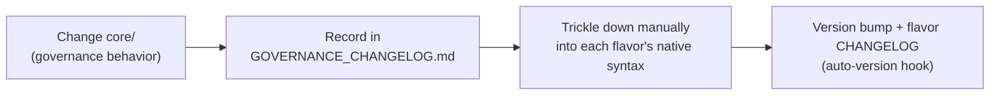

# Governance Change

Because every level [derives from the one above](02-architecture.md), changing a
high level can propagate inconsistencies everywhere below it. AAIG therefore
applies a **stricter process to higher-risk changes**.

## Change risk by level

| Change target | Process |
|---|---|
| **L0 / L1** (`L0_Assimilation_Protocol.md`, `L1_Core_Principles.md`, `L1_Framework_Architecture.md`) | High-risk protocol below |
| **L2 and below** (domains, workflows, skills, flavor files) | Standard [Review Principle](03-core-principles.md) |

## High-risk protocol (L0/L1)

Changes to L0/L1 documents **require all** of:

1. **Mandatory human review** — self-review by the proposing agent is
   explicitly prohibited.
2. **Cross-level impact assessment** — document which L2 rules and L3 workflows
   the change affects, *before* merging.
3. **Version bump** — increment the `Version` field in the modified file.
4. **Changelog entry** — record what changed and why in
   `core/GOVERNANCE_CHANGELOG.md`.

## Core → flavor contribution flow

- Generic governance behavior is changed in **`core/` first**, then recorded in
  `core/GOVERNANCE_CHANGELOG.md`.
- Changes are then **manually trickled down** into each flavor's native
  structures (agents, instructions, skills). There is intentionally no automatic
  propagation — flavors adapt semantics to host-specific syntax.
- In the [Copilot flavor](09-flavor-github-copilot.md), the change lands in the
  flavor `CHANGELOG.md`, and the [auto-version hook](12-deployment.md) bumps the
  patch version on commit.

## Artifact conventions

All level artifacts (L1–L4) carry a descriptive filename, the artifact's level,
a version identifier, and a creation date. Operational artifacts (action logs,
ADRs) are not level-classified but still follow filename + timestamp
conventions.

## Continuous improvement loop

After each workflow, agents produce a short retrospective and open a governance
issue when they propose an improvement — the mechanism by which the framework
[evolves from experience](03-core-principles.md). In the flavor these land under
`.github/retros/`.

## See also

- [Architecture](02-architecture.md) · [Core Principles (L1)](03-core-principles.md) · [Benchmark](08-benchmark.md)
