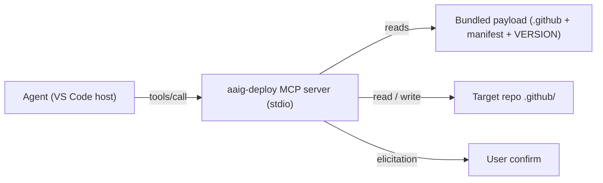

# Idea / Spec: AAIG Deploy as an MCP Server

> copilot:generated | implementer | 2026-07-07

**Status:** Draft + working read-only PoC (`../mcp-deploy/`).
**Author:** agent (implementer), reviewed by human.

## 1. Summary

Today, deploying/updating the AAIG framework into a project requires **cloning
the AAIG repo locally**, placing it beside the target, and running
`deploy.ps1` / `deploy.sh`. This spec proposes packaging the deploy as an
**MCP server** that a user installs once; the agent then drives the deploy
through MCP tools — **no sibling clone**.

A read-only proof of concept (`af_status`, `af_dry_run`, `af://source/{path}`)
is implemented in [`../mcp-deploy/`](../mcp-deploy/) and validated against the
real reference deploy.

## 2. Motivation & goals

| Goal | Why |
|---|---|
| **No local AAIG clone** | The payload ships *inside* the server package, versioned — install once, update by bumping the package. |
| **One codebase, cross-platform** | Retires the `deploy.ps1` **+** `deploy.sh` parity burden (a recurring maintenance cost). |
| **Structured I/O** | Today the agent parses `.ps1` stdout text; MCP tools return JSON (conflicts, hashes, counts) → more reliable decisions. |
| **Discoverable, trusted install** | VS Code MCP gallery, trust prompt, per-tool confirmation, enterprise policy, Settings-Sync. |
| **Payload pinning + integrity** | The server bundles a specific framework release (hash-verified). |

## 3. Non-goals & the key constraint

**VS Code custom agents/instructions/skills are file-based** — discovered from
`.github/agents`, `.github/instructions`, etc. on disk. An MCP server can
**write/manage** those files but cannot *be* them. So this is not
"framework-over-MCP"; the files still land on disk. MCP is the **delivery and
merge mechanism**, replacing the clone+script, not the file layout.

Out of scope: git operations (commit/PR), notebook tooling, and any change to
the framework's on-disk structure.

## 4. Architecture

- **Transport:** local **stdio** server (same machine → filesystem access).
  A remote HTTP variant is possible but the deploy needs local FS writes, so
  stdio is the natural fit.
- **Bundled payload:** the `flavors/github-copilot/.github` tree + `.af-manifest`
  + `VERSION`, embedded as package data at build time (pinned, hashed). A
  `--channel`/env override can select a specific release; `AF_SOURCE_ROOT`
  points at an on-disk payload in dev mode.
- **Target selection:** the agent passes the workspace path
  (`${workspaceFolder}`) as a tool argument; the server refuses paths outside it.



## 5. Interface

### Tools

| Tool | R/W | Purpose |
|---|---|---|
| `af_status(workspace_root)` | R | Bundled vs deployed version (`up-to-date` / `stale` / `not-deployed`). |
| `af_dry_run(workspace_root)` | R | Per-file 3-way classification + counts. |
| `af_list_conflicts(workspace_root)` | R | Just the CONFLICT set with diffs. |
| `af_get_source_file(path)` | R | Bundled source content (also a resource). |
| `af_get_target_file(workspace_root, path)` | R | Deployed content, for the agent to merge. |
| `af_apply(workspace_root, confirm)` | **W** | Apply non-conflict updates; back up first; never touch `[customizable]`/CONFLICT. |
| `af_write_resolved(workspace_root, path, content)` | **W** | Write an agent-merged file (conflict resolution). |
| `af_update_hashes(workspace_root)` | **W** | Re-baseline `.af-hashes` after resolution. |
| `af_prune_backups(workspace_root, days)` | **W** | Housekeeping. |

The PoC implements only the **R** tools + `af_get_source_file` (as a resource).

### Resources

- `af://source/{path}` — bundled source files (agent reads them as context).
- `af://conflict/{path}` — a unified diff for each conflict (Phase 1).

### Prompts

- `/af.deploy` — guided deploy (status → dry-run → confirm → apply → rebaseline).
- `/af.resolve-conflicts` — walk the CONFLICT set, decide take-AF vs keep-project.

### Client primitives

- **Elicitation** — the server asks the user to confirm risky steps
  (apply, overwrite a `[customizable]` file) instead of a terminal prompt.
- **Sampling** — optional: the server could ask the host LLM to propose a merge,
  staying model-independent. Prefer leaving semantic merges to the agent (it
  has full context).

## 6. Determinism & parity

The classification and hashing must match the reference deploy so `af_dry_run`
and the script agree:

- **Hash:** SHA-256, **uppercase** hex (matches PowerShell `Get-FileHash`).
- **Tier resolution:** `model: __AF_TIER_X__` → single line or prioritized YAML
  array, newline-preserving — byte-compatible with `deploy.ps1`
  `Resolve-TierTokens`. Tier files are hashed over resolved UTF-8 (no BOM) bytes.
- **Path keys:** normalize to forward slashes.
  - **Finding from the PoC:** `deploy.ps1` builds hash keys with **backslashes**
    on Windows but stores the `[customizable]` set with **forward slashes**, so
    customizable files *inside directories* (e.g. `scripts/run-tests.sh`,
    `skills/INDEX.md`) are **not detected as customizable** on Windows — they
    fall through to the non-customizable branch (`UPDATE`/`CONFLICT` instead of
    `PROTECT`/`PRESERVE`). Not data-loss (CONFLICT is still skipped), but a real
    inconsistency. The MCP reimplementation fixes this by normalizing keys. This
    bug should also be patched in `deploy.ps1` separately.

## 7. Security model

Moving the deploy to MCP **shifts the trust boundary**:

- The `block-dangerous` terminal hook (hardened elsewhere) **does not see MCP
  tool calls** — they are not terminal commands. So the deploy's safety must be
  **self-contained in the server**: dry-run default, writes scoped to
  `workspace_root` (refuse paths outside), mandatory backups before overwrite,
  `[customizable]`/CONFLICT never overwritten without elicitation, structured
  audit output.
- **VS Code trust:** local MCP servers "can run arbitrary code" — a trust
  prompt gates first start; tool calls can require per-call confirmation.
- **Windows caveat:** VS Code's MCP filesystem **sandbox** (`sandboxEnabled` +
  `allowWrite: ["${workspaceFolder}"]`) is **macOS/Linux only**. On Windows the
  server runs unsandboxed with the user's rights → safety rests on the trust
  prompt + the server's own guards. Sign/pin the package; keep dry-run default.

## 8. Distribution & release pipeline

1. Build embeds the current `flavors/github-copilot/.github` payload + `VERSION`
   + `.af-manifest` as package data; record an integrity hash.
2. Publish (npm `@aaig/deploy-mcp` and/or PyPI `aaig-deploy-mcp` via `uvx`,
   optionally an OCI image).
3. The existing `VERSION` + auto-version pre-commit hook drive payload
   versioning; a release tag cuts a package version.
4. `.vscode/mcp.json` (workspace, shareable) or user config points at the server.

```jsonc
{ "servers": { "aaig-deploy": { "type": "stdio", "command": "aaig-deploy-mcp" } } }
```

## 9. Phased roadmap

| Phase | Scope |
|---|---|
| **0 — PoC (done)** | Read-only `af_status`, `af_dry_run`, `af://source/{path}`; parity with the script; unit tests. |
| **1 — Write path (implemented; real elicitation remaining)** | `af_apply`, `af_write_resolved`, `af_update_hashes`, `af_prune_backups`, `af_conflict_diff`; workspace-scoped writes; backups; `[customizable]`/CONFLICT never written; `[vscode]` files covered; `confirm` guard. Remaining: MCP *elicitation* (the PoC gates on a `confirm` flag). |
| **2 — UX (prompts done; packaging remaining)** | `af_deploy` + `af_resolve_conflicts` prompts implemented (surface as `/mcp.aaig-deploy.*`, dependency-free text builders in `prompts.py`). Remaining: packaged distribution (npm/PyPI/OCI); payload bundling + integrity. |
| **3 — Adoption (aspirational)** | Documented opt-in install. The server stays **parallel to and experimental beside** `deploy.ps1`/`deploy.sh` — the scripts remain the supported, CI-integrated path. Retiring the scripts is **not** planned for this PoC and would only be *considered* once cross-platform parity (incl. the Windows no-sandbox caveat) is proven and file-based customizations are covered. |

## 10. PoC results

Implemented in [`../mcp-deploy/`](../mcp-deploy/):

- `aaig_deploy_mcp/deploy_core.py` — dependency-free logic: version status,
  manifest parse, tier resolution, 3-way classification, **and the guarded write
  path** (`apply` with backups, `update_hashes`, `write_resolved`,
  `conflict_diff`, `prune_backups`). Covers `.github/` and `[vscode]` files.
- `aaig_deploy_mcp/server.py` — `FastMCP` server: read tools (`af_status`,
  `af_dry_run`, `af_conflict_diff`) + write tools (`af_apply`,
  `af_write_resolved`, `af_update_hashes`, `af_prune_backups`, each guarded by
  `confirm`) + `af://source/{path}` + workflow prompts (`af_deploy`,
  `af_resolve_conflicts`).
- `aaig_deploy_mcp/prompts.py` — dependency-free prompt-text builders (so the
  workflow guidance is unit-testable without the `mcp` framework).
- `tests/` — **25 unit tests, all passing** (tier array / inline / CRLF, status
  states, every classification path, apply + backup, customizable-skip,
  path-traversal refusal, conflict diff, rebaseline, prune, `[vscode]`
  deploy/preserve/apply/diff, and the two prompt workflows).

**Validation against the real reference deploy** (MP target, v1.19.9): the PoC
`af_dry_run` matched `deploy.ps1` on the version status and the 14 EOL-driven
`.sh` `UPDATE`s, and **correctly** classified the within-directory customizable
`scripts/run-tests.sh` as `PROTECT` where `deploy.ps1` wrongly reports `UPDATE`
(the §6 key-normalization bug).

## 11. Open questions

- Language for the shipped server: **TypeScript** (npm/`npx` is the MCP norm)
  vs **Python** (`uvx`; PoC language). Recommend TS for distribution, keeping
  the Python PoC as the executable spec.
- Should `af_apply` ever run non-interactively (CI), or always require
  elicitation? (Lean: CI uses the script; interactive uses MCP.)
- Patch the `deploy.ps1`/`deploy.sh` customizable-key bug now, independently of
  this effort.
